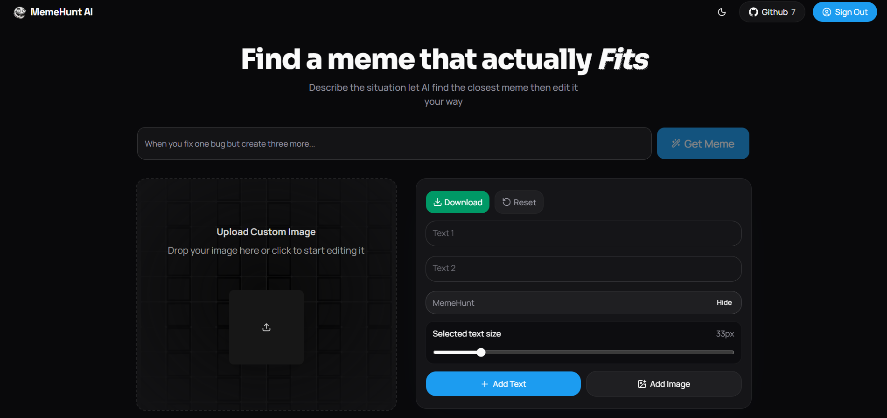

# MemeHunt

An AI meme finder and editor built with Next.js. MemeHunt helps users find the right meme for a situation, customize it in a canvas editor, and download the final image.




## Features

- AI-powered meme matching
- Canvas-based meme editor
- Custom text and image overlays
- Default and custom watermark support
- Google sign-in with guest usage limits
- Fully responsive UI

## Tech Stack

**Frontend:** Next.js, React, Tailwind CSS, shadcn/ui, Motion, Konva, Lucide Icons

**Backend:** Next.js API Routes, Node.js, PostgreSQL, Prisma, Vercel AI SDK

**Authentication:** Better Auth with Google OAuth

## Getting Started

### Prerequisites

- Node.js 18+
- PostgreSQL database
- Google OAuth credentials

### Installation

1. Clone the repository
```bash
git clone https://github.com/your-username/memehunt.git
cd memehunt
```

2. Install dependencies
```bash
npm install
```

3. Configure environment variables

Create a `.env` file in the root directory:

```env
DATABASE_URL=your_postgres_connection_string
BETTER_AUTH_URL=http://localhost:3000
GOOGLE_CLIENT_ID=your_google_client_id
GOOGLE_CLIENT_SECRET=your_google_client_secret
```

4. Run the development server
```bash
npm run dev
```

Open [http://localhost:3000](http://localhost:3000) in your browser.

## Scripts

```bash
npm run dev
npm run build
npm run start
npm run lint
```


## License

No license has been added yet.

Contributions are welcome, but all rights are reserved unless a separate `LICENSE` file is included in this repository.
