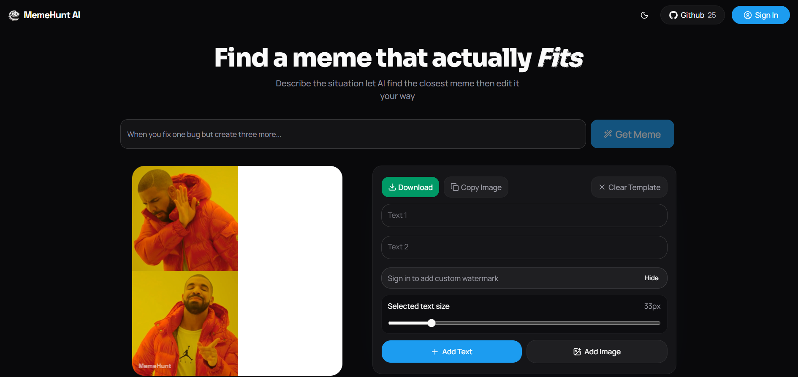

# MemeHunt

An AI meme finder and editor built with Next.js. MemeHunt uses retrieval-augmented generation (RAG) to find semantically relevant meme templates, lets users customize them in a canvas editor, and exports the final image.




## Features

- RAG-powered meme matching with Gemini embeddings and Neon pgvector
- Semantic retrieval of the 12 most relevant templates before AI ranking
- Canvas-based meme editor
- Custom text and image overlays
- Default and custom watermark support
- Google sign-in with guest usage limits
- Fully responsive UI
- Automatic embeddings for new and edited admin templates
- Resumable embedding backfill for bulk imports


## Tech Stack

**Frontend:** Next.js, React, Tailwind CSS, shadcn/ui, Motion, Konva, Lucide Icons

**Backend:** Next.js API Routes, Node.js, Neon Postgres, pgvector, Prisma, Vercel AI SDK

**AI:** Gemini (`gemini-embedding-001` for 768-dimensional embeddings, Gemini/Groq for template ranking)

**Authentication:** Better Auth with Google OAuth

## Getting Started

### Prerequisites

- Node.js 18+
- Neon Postgres database (or PostgreSQL with the `pgvector` extension)
- Gemini API key
- Google OAuth credentials

### Installation

1. Clone the repository
```bash
git clone https://github.com/your-username/memehunt.git
cd memehunt
```

2. Install dependencies
```bash
npm install
```

3. Configure environment variables

Create a `.env` file in the root directory:

```env
DATABASE_URL=your_postgres_connection_string
GOOGLE_GENERATIVE_AI_API_KEY=your_gemini_api_key
GROQ_API_KEY=your_groq_api_key
BETTER_AUTH_SECRET=your_auth_secret
BETTER_AUTH_URL=http://localhost:3000
GOOGLE_CLIENT_ID=your_google_client_id
GOOGLE_CLIENT_SECRET=your_google_client_secret
CLOUDINARY_CLOUD_NAME=your_cloudinary_cloud_name
CLOUDINARY_API_KEY=your_cloudinary_api_key
CLOUDINARY_API_SECRET=your_cloudinary_api_secret
```

4. Apply database migrations, including `pgvector`

```bash
npx prisma migrate deploy
```

5. Generate embeddings for existing templates

```bash
npm run embed-meme-templates
```

6. Run the development server
```bash
npm run dev
```

Open [http://localhost:3000](http://localhost:3000) in your browser.

## Scripts

```bash
npm run dev
npm run build
npm run start
npm run lint
npm run embed-meme-templates
```

`embed-meme-templates` processes only templates without a current embedding version, making it safe to rerun after bulk imports or a failed embedding request.

## Adding meme templates

Add templates through the admin interface with a descriptive name, description, best-fit notes, and tags. MemeHunt automatically creates or refreshes the template embedding after an admin create or edit.

For large/bulk imports, run `npm run embed-meme-templates` afterwards to ensure every template is indexed.

## Production deployment

1. Set the production deployment's `DATABASE_URL` to the production Neon branch.
2. Deploy the application code.
3. Run `npx prisma migrate deploy` against production.
4. Run `npm run embed-meme-templates` against production.


## License

No license has been added yet.

Contributions are welcome, but all rights are reserved unless a separate `LICENSE` file is included in this repository.
